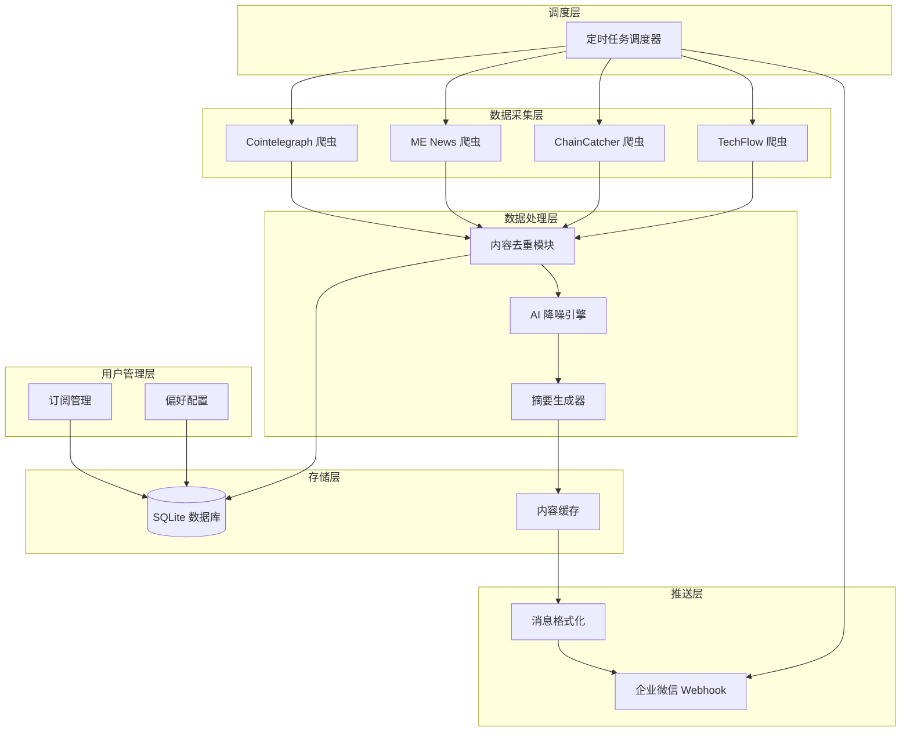

# Design Document

> **相关文档**：
> - [API 配置与 Prompt 调优指南](../api-config-guide.md)
> - [Prompt 合集](../prompts.md)
> - [选型报告](../selection-report.md)

## Overview

本系统基于 TrendRadar 开源框架构建 Web3 信息智能聚合与降噪推送系统。
本系统基于 TrendRadar 开源框架构建 Web3 信息智能聚合与降噪推送系统。系统采用模块化架构，包含数据采集层、AI 处理层、用户管理层和消息推送层。部署在本地 Windows 电脑上通过 Docker 容器化运行，使用企业微信 (WeCom) Webhook 实现消息推送。

### 技术选型理由

选择 TrendRadar 的原因：
1. **多平台支持**: 原生支持 35+ 平台，易于扩展 Web3 信息源
2. **MCP 架构**: 基于 Model Context Protocol 的 AI 分析能力
3. **推送渠道**: 原生支持企业微信 Webhook 推送
4. **轻量部署**: Docker 一键部署，适合本地长期运行
5. **过滤机制**: 内置关键词过滤和必选词机制，适合降噪需求

## Architecture



## Components and Interfaces

### 1. 数据采集模块 (Crawler Module)

负责从 4 个 Web3 信息源采集内容。

```python
class BaseCrawler:
    """爬虫基类"""
    def __init__(self, source_name: str, base_url: str):
        self.source_name = source_name
        self.base_url = base_url
    
    def fetch(self) -> List[RawArticle]:
        """获取原始文章列表"""
        raise NotImplementedError
    
    def parse(self, html: str) -> List[RawArticle]:
        """解析 HTML 内容"""
        raise NotImplementedError

class CointelegraphCrawler(BaseCrawler):
    """Cointelegraph 爬虫"""
    pass

class MENewsCrawler(BaseCrawler):
    """ME News 爬虫"""
    pass

class ChainCatcherCrawler(BaseCrawler):
    """ChainCatcher 爬虫"""
    pass

class TechFlowCrawler(BaseCrawler):
    """TechFlow 深潮爬虫"""
    pass
```

### 2. AI 降噪引擎 (Noise Filter Engine)

基于规则和 AI 模型进行内容过滤和信号提取。

```python
class NoiseFilterEngine:
    """AI 降噪引擎"""
    
    def __init__(self, config: FilterConfig):
        self.noise_keywords = config.noise_keywords  # 噪音关键词
        self.signal_keywords = config.signal_keywords  # 信号关键词
        self.ai_client = config.ai_client
    
    def filter(self, articles: List[Article]) -> List[Article]:
        """过滤噪音内容"""
        pass
    
    def classify(self, article: Article) -> ArticleCategory:
        """分类文章: 协议更新/投融资/安全事件/其他"""
        pass
    
    def extract_signal(self, article: Article) -> SignalInfo:
        """提取核心信号"""
        pass
```

### 3. 摘要生成器 (Summary Generator)

将多条新闻压缩为结构化简报。

```python
class SummaryGenerator:
    """简报生成器"""
    
    def generate_daily_summary(self, articles: List[Article]) -> DailySummary:
        """生成每日简报"""
        pass
    
    def format_for_wechat(self, summary: DailySummary) -> str:
        """格式化为微信消息格式"""
        pass
    
    def split_if_needed(self, content: str, max_length: int = 2048) -> List[str]:
        """超长内容分段"""
        pass
```

### 4. 用户订阅管理 (Subscription Manager)

管理用户订阅状态和偏好。

```python
class SubscriptionManager:
    """订阅管理器"""
    
    def subscribe(self, user_id: str) -> bool:
        """用户订阅"""
        pass
    
    def unsubscribe(self, user_id: str) -> bool:
        """取消订阅"""
        pass
    
    def get_status(self, user_id: str) -> SubscriptionStatus:
        """获取订阅状态"""
        pass
    
    def set_preferences(self, user_id: str, prefs: UserPreferences) -> bool:
        """设置用户偏好"""
        pass
    
    def get_active_subscribers(self) -> List[Subscriber]:
        """获取活跃订阅用户"""
        pass
```

### 5. 微信推送模块 (WeChat Push Module)

通过企业微信 Webhook 发送消息。

```python
class WeChatPusher:
    """企业微信推送器"""
    
    def __init__(self, webhook_url: str):
        self.webhook_url = webhook_url
    
    def send_text(self, content: str) -> PushResult:
        """发送文本消息"""
        pass
    
    def send_markdown(self, content: str) -> PushResult:
        """发送 Markdown 消息"""
        pass
    
    def send_to_user(self, user_id: str, content: str) -> PushResult:
        """发送给指定用户"""
        pass
```

### 6. 调度器 (Scheduler)

管理定时任务执行。

```python
class TaskScheduler:
    """任务调度器"""
    
    def schedule_crawl(self, interval_minutes: int = 30):
        """调度采集任务"""
        pass
    
    def schedule_daily_push(self, push_time: str = "09:00"):
        """调度每日推送"""
        pass
    
    def run(self):
        """启动调度器"""
        pass
```

## Data Models

### 核心数据模型

```python
from dataclasses import dataclass
from datetime import datetime
from enum import Enum
from typing import List, Optional

class ArticleCategory(Enum):
    """文章分类"""
    PROTOCOL_UPDATE = "protocol_update"  # 协议更新
    FUNDING = "funding"                   # 投融资
    SECURITY = "security"                 # 安全事件
    MARKET = "market"                     # 市场动态
    OTHER = "other"                       # 其他

class SubscriptionStatus(Enum):
    """订阅状态"""
    ACTIVE = "active"
    INACTIVE = "inactive"
    PAUSED = "paused"

@dataclass
class RawArticle:
    """原始文章"""
    source: str
    url: str
    title: str
    content: str
    published_at: datetime
    raw_html: Optional[str] = None

@dataclass
class Article:
    """处理后的文章"""
    id: str
    source: str
    url: str
    title: str
    summary: str
    category: ArticleCategory
    signal_score: float  # 信号强度 0-1
    keywords: List[str]
    published_at: datetime
    processed_at: datetime
    content_hash: str  # 用于去重

@dataclass
class DailySummary:
    """每日简报"""
    date: str
    total_articles: int
    filtered_articles: int
    categories: dict  # 分类统计
    highlights: List[str]  # 重点摘要
    articles: List[Article]

@dataclass
class Subscriber:
    """订阅用户"""
    user_id: str
    status: SubscriptionStatus
    subscribed_at: datetime
    preferences: Optional['UserPreferences'] = None

@dataclass
class UserPreferences:
    """用户偏好"""
    keywords: List[str]  # 关注关键词
    categories: List[ArticleCategory]  # 关注分类
    push_time: str  # 推送时间偏好

@dataclass
class FilterConfig:
    """过滤配置"""
    noise_keywords: List[str]  # 噪音关键词: 空投、白名单、免费领取等
    signal_keywords: List[str]  # 信号关键词: 融资、漏洞、升级等
    min_signal_score: float = 0.5

@dataclass
class PushResult:
    """推送结果"""
    success: bool
    message_id: Optional[str]
    error: Optional[str]
    timestamp: datetime
```

### 数据库 Schema (SQLite)

```sql
-- 文章表
CREATE TABLE articles (
    id TEXT PRIMARY KEY,
    source TEXT NOT NULL,
    url TEXT UNIQUE NOT NULL,
    title TEXT NOT NULL,
    summary TEXT,
    category TEXT,
    signal_score REAL,
    keywords TEXT,  -- JSON array
    published_at TIMESTAMP,
    processed_at TIMESTAMP,
    content_hash TEXT UNIQUE,
    is_pushed INTEGER DEFAULT 0
);

-- 订阅用户表
CREATE TABLE subscribers (
    user_id TEXT PRIMARY KEY,
    status TEXT NOT NULL,
    subscribed_at TIMESTAMP,
    preferences TEXT  -- JSON object
);

-- 推送记录表
CREATE TABLE push_logs (
    id INTEGER PRIMARY KEY AUTOINCREMENT,
    user_id TEXT,
    content TEXT,
    push_type TEXT,
    success INTEGER,
    error TEXT,
    created_at TIMESTAMP
);

-- 系统日志表
CREATE TABLE system_logs (
    id INTEGER PRIMARY KEY AUTOINCREMENT,
    level TEXT,
    module TEXT,
    message TEXT,
    created_at TIMESTAMP
);
```


## Correctness Properties

*A property is a characteristic or behavior that should hold true across all valid executions of a system-essentially, a formal statement about what the system should do. Properties serve as the bridge between human-readable specifications and machine-verifiable correctness guarantees.*

### Property 1: 内容去重幂等性

*For any* 文章集合，经过去重处理后，不应存在两篇具有相同 content_hash 的文章。对同一集合多次执行去重操作，结果应保持不变。

**Validates: Requirements 2.4**

### Property 2: 噪音关键词过滤完整性

*For any* 包含噪音关键词（空投、白名单、免费领取等）的文章，经过降噪引擎处理后，该文章应被标记为噪音并从结果集中移除。

**Validates: Requirements 3.2**

### Property 3: 信号关键词保留完整性

*For any* 包含信号关键词（协议更新、融资、安全漏洞等）的文章，经过降噪引擎处理后，该文章应被保留在结果集中，且 signal_score > 0。

**Validates: Requirements 3.3**

### Property 4: 订阅状态一致性

*For any* 用户，执行订阅操作后查询状态应为 ACTIVE，执行取消订阅操作后查询状态应为 INACTIVE。订阅后再取消应恢复到未订阅状态。

**Validates: Requirements 4.1, 4.2**

### Property 5: 用户偏好持久化

*For any* 用户偏好设置，保存后查询应返回完全相同的偏好配置。偏好应正确应用于内容筛选。

**Validates: Requirements 4.3, 4.4**

### Property 6: 简报格式完整性

*For any* 非空文章列表，生成的简报应包含：日期、文章总数、分类统计、重点摘要列表。所有必填字段不应为空。

**Validates: Requirements 5.2**

### Property 7: 消息分段正确性

*For any* 超过微信消息长度限制（2048 字符）的内容，分段后每段长度应不超过限制，且所有分段拼接后应包含原始内容的所有信息。

**Validates: Requirements 5.3**

### Property 8: 推送覆盖完整性

*For any* 活跃订阅用户集合，执行每日推送后，每个活跃用户都应收到推送（或有对应的推送记录）。

**Validates: Requirements 5.1**

## Error Handling

### 错误分类与处理策略

| 错误类型 | 处理策略 | 重试机制 |
|---------|---------|---------|
| 网络超时 | 记录日志，下次调度重试 | 最多 3 次，间隔递增 |
| 信息源不可用 | 跳过该源，继续其他源 | 下次调度重试 |
| AI API 错误 | 使用备用规则过滤 | 最多 2 次 |
| 微信推送失败 | 记录失败，稍后重试 | 最多 3 次 |
| 数据库错误 | 记录错误，触发告警 | 不自动重试 |
| 配置解析错误 | 使用默认配置，记录警告 | 不重试 |

### 异常恢复机制

```python
class ErrorHandler:
    """错误处理器"""
    
    def handle_crawl_error(self, source: str, error: Exception):
        """处理采集错误"""
        log_error(f"Crawl failed for {source}: {error}")
        schedule_retry(source, delay_minutes=5)
    
    def handle_push_error(self, user_id: str, error: Exception):
        """处理推送错误"""
        log_error(f"Push failed for {user_id}: {error}")
        mark_for_retry(user_id)
    
    def handle_ai_error(self, error: Exception):
        """处理 AI 错误，降级到规则过滤"""
        log_warning(f"AI error, falling back to rules: {error}")
        return use_rule_based_filter()
```

## Testing Strategy

### 单元测试

使用 pytest 进行单元测试，覆盖核心模块：

1. **爬虫模块测试**: 测试 HTML 解析、数据提取
2. **去重模块测试**: 测试哈希计算、重复检测
3. **过滤引擎测试**: 测试关键词匹配、分类逻辑
4. **摘要生成测试**: 测试格式化、分段逻辑
5. **订阅管理测试**: 测试状态变更、偏好存储

### 属性测试

使用 **Hypothesis** 库进行属性测试：

```python
from hypothesis import given, strategies as st

# Property 1: 去重幂等性
@given(st.lists(st.builds(Article, ...)))
def test_dedup_idempotent(articles):
    result1 = dedup(articles)
    result2 = dedup(result1)
    assert result1 == result2
    assert len(set(a.content_hash for a in result1)) == len(result1)

# Property 2: 噪音过滤
@given(st.text().filter(lambda t: any(k in t for k in NOISE_KEYWORDS)))
def test_noise_filtered(content):
    article = Article(content=content, ...)
    result = filter_engine.filter([article])
    assert article not in result

# Property 7: 分段正确性
@given(st.text(min_size=2049, max_size=10000))
def test_split_respects_limit(content):
    segments = split_if_needed(content, max_length=2048)
    for seg in segments:
        assert len(seg) <= 2048
```

### 集成测试

1. **端到端采集测试**: 模拟完整采集流程
2. **推送集成测试**: 使用测试 Webhook 验证推送
3. **调度器测试**: 验证定时任务触发

### 测试配置

```yaml
# pytest.ini
[pytest]
testpaths = tests
python_files = test_*.py
addopts = --hypothesis-show-statistics -v

# hypothesis profile
hypothesis:
  max_examples: 100
  deadline: 5000
```

## 附录

### 配置文档

详细的 API 配置和 Prompt 调优过程请参考：

- **[API 配置与 Prompt 调优指南](../api-config-guide.md)**
  - RSS 源配置（15 个已接入）
  - Web3 爬虫配置
  - 推送渠道 API 配置
  - AI API 配置
  - Prompt 调优过程记录

- **[Prompt 合集](../prompts.md)**
  - 信息降噪 Prompt
  - 摘要生成 Prompt
  - 重要性评分 Prompt
  - 调优历程记录

### 数据源状态

当前系统已接入 17 个数据源：

| 类型 | 数量 | 状态 |
|-----|------|-----|
| RSS 源 | 15 | 14 正常 / 1 异常 |
| Web3 爬虫 | 2 | 1 正常 / 1 SSL 过期 |

详细配置见 `config/config.yaml`。
